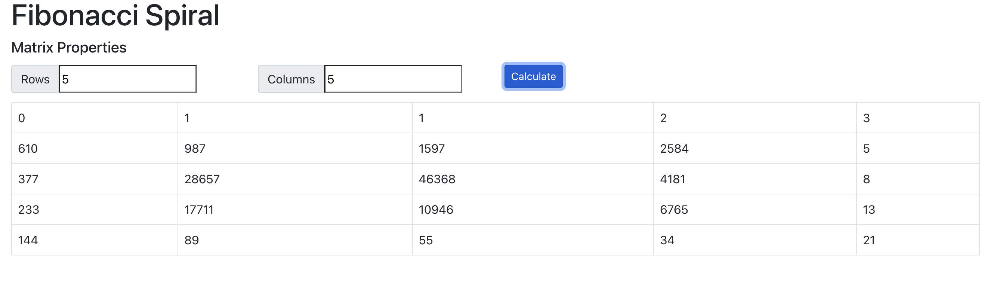

## Available Scripts

In the project directory, you can run:

### `npm start`

Runs the app in the development mode.\
Open [http://localhost:3000](http://localhost:3000) to view it in your browser.

## Docker

You can run the app locally with Docker

Build image:
```docker build -t r2-spiral/frontend .```

Run image:

```docker run -p 3000:3000 r2-spiral/frontend```


